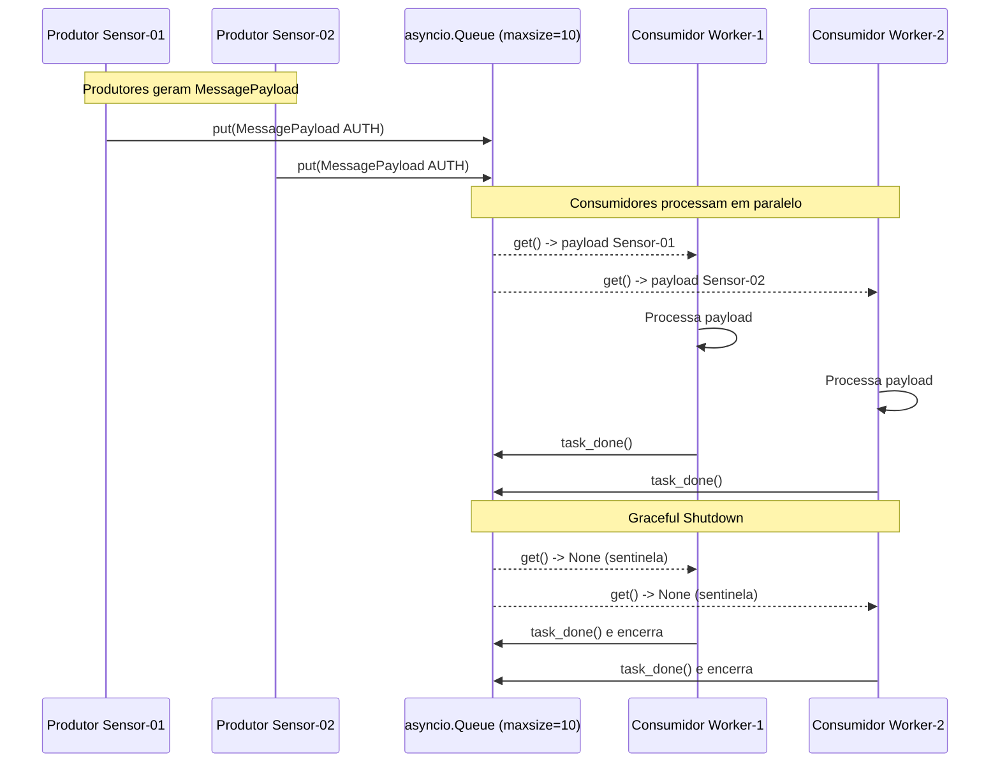

# 🏆 Exercício Prático: Pipeline Assíncrono com Produtor, Fila e Consumidores em Python

Nesta atividade, você aplicará os conceitos fundamentais de **Concorrência Estruturada**, **Desacoplamento por Filas Assíncronas** para construir um pipeline de ingestão e processamento de telemetria distribuída de alta performance.

---

## 🎯 Contexto e Objetivo do Desafio

Imagine que você está desenvolvendo o núcleo de ingestão de um sistema de IoT industrial. Centenas de nós sensores enviam pacotes de eventos (`MessagePayload`) com comandos de autenticação (`AUTH`), consultas métricas (`QUERY`) e encerramento (`DISCONNECT`).

Se a recepção de dados processar as regras de negócio diretamente de forma monolítica ou sequencial, um gargalo em banco de dados ou RPC travará toda a ingestão.

**Sua missão:** Construir um pipeline desacoplado e resiliente contendo **Produtores**, uma **Fila Assíncrona Delimitada (`asyncio.Queue`)** e um pool de **Consumidores (*Workers*)**, orquestrados pelo guardião moderno de concorrência: **`asyncio.TaskGroup`**.

---

## 📦 1. O Contrato Disponibilizado: `MessagePayload`

Para este desafio, a modelagem de domínio do protocolo de rede **já foi implementada e testada**. O arquivo [message_payload.py](./message_payload.py) já está disponível na sua árvore de código para uso.

---

## 🏗️ 2. Arquitetura do Pipeline

A solução a ser desenvolvida deve seguir rigorosamente a separação de responsabilidades ilustrada no diagrama abaixo:



---

## 📋 3. Requisitos Obrigatórios de Implementação

Você deverá criar o script executável contendo 3 blocos bem definidos:

### 🔹 Requisito 1: O Produtor (`produtor`)
- **Assinatura:** `async def produtor(nome: str, acoes: list[tuple[ActionType, str]], fila: asyncio.Queue[MessagePayload | None]) -> None`
- **Responsabilidades:**
  1. Iterar sobre a lista de `acoes` (pares de `ação` e `conteúdo`).
  2. Criar a instância tipada de `MessagePayload` utilizando o método `MessagePayload.create(...)`.
  3. Inserir a mensagem na fila via `await fila.put(payload)`. Se a fila estiver cheia (`maxsize`), o produtor deve suspender cooperativamente sem travar o Event Loop (*Backpressure*).
  4. Simular um breve intervalo de envio assíncrono com `await asyncio.sleep(0.05)`.
  5. Emitir logs informativos de início, enfileiramento e término.

### 🔹 Requisito 2: O Consumidor / Worker (`consumidor`)
- **Assinatura:** `async def consumidor(worker_id: int, fila: asyncio.Queue[MessagePayload | None]) -> None`
- **Responsabilidades:**
  1. Executar um laço infinito (`while True`) aguardando itens da fila com `payload = await fila.get()`.
  2. **Tratamento de Sentinela (*Graceful Shutdown*):** Se `payload is None`, chamar `fila.task_done()`, registrar log de encerramento e sair do laço com `break`.
  3. **Processamento:** Exibir os dados processados (`client_id`, `action`, `content`) e simular o tempo de processamento com `await asyncio.sleep(0.1)`.
  4. **Garantia de Confirmação:** Chamar obrigatoriamente `fila.task_done()` dentro de um bloco `finally` para evitar travamentos permanentes (*deadlocks*) no `join()`.

### 🔹 Requisito 3: O Orquestrador Principal (`main`)
- **Assinatura:** `async def main() -> None`
- **Responsabilidades:**
  1. Instanciar a fila com limite máximo de capacidade: `fila = asyncio.Queue(maxsize=10)`.
  2. Definir ao menos 2 lotes de ações para 2 sensores simulados distintos.
  3. Utilizar o bloco **`async with asyncio.TaskGroup() as tg:`** para supervisionar toda a concorrência:
     - Criar as tarefas dos consumidores: `tg.create_task(consumidor(w_id, fila))`.
     - Criar as tarefas dos produtores: `tg.create_task(produtor(...))`.
  4. Aguardar o processamento completo de todos os itens da fila com `await fila.join()`.
  5. Enviar a sentinela de desligamento (`None`) para cada um dos consumidores ativos (`await fila.put(None)`).

---

## 🖥️ 4. Exemplo de Saída Esperada no Terminal

Ao executar `uv run main.py`, a saída dos logs deve refletir a intercalação e o encerramento limpo:

```text
16:45:25 [INFO] === Iniciando Pipeline Produtor-Fila-Consumidor ===
16:45:25 [INFO] [Consumidor 1] Worker pronto e aguardando mensagens...
16:45:25 [INFO] [Consumidor 2] Worker pronto e aguardando mensagens...
16:45:25 [INFO] [Produtor Sensor-01] Iniciando geração de mensagens...
16:45:25 [INFO] [Produtor Sensor-01] Enfileirando -> AUTH: token_alpha_123
16:45:25 [INFO] [Produtor Sensor-02] Iniciando geração de mensagens...
16:45:25 [INFO] [Produtor Sensor-02] Enfileirando -> AUTH: token_beta_456
16:45:25 [INFO] [Consumidor 1] Processando mensagem de [Sensor-01] | Ação: AUTH | Conteúdo: token_alpha_123
16:45:25 [INFO] [Consumidor 2] Processando mensagem de [Sensor-02] | Ação: AUTH | Conteúdo: token_beta_456
16:45:25 [INFO] [Produtor Sensor-01] Enfileirando -> QUERY: SELECT temp FROM sala_01
16:45:25 [INFO] [Produtor Sensor-02] Enfileirando -> QUERY: SELECT pressao FROM tanque_02
16:45:25 [INFO] [Consumidor 1] Processando mensagem de [Sensor-01] | Ação: QUERY | Conteúdo: SELECT temp FROM sala_01
16:45:25 [INFO] [Consumidor 2] Processando mensagem de [Sensor-02] | Ação: QUERY | Conteúdo: SELECT pressao FROM tanque_02
16:45:25 [INFO] [Produtor Sensor-01] Enfileirando -> DISCONNECT: logout
16:45:25 [INFO] [Produtor Sensor-02] Finalizou a produção de mensagens.
16:45:25 [INFO] [Produtor Sensor-01] Finalizou a produção de mensagens.
16:45:25 [INFO] [Consumidor 1] Processando mensagem de [Sensor-01] | Ação: DISCONNECT | Conteúdo: logout
16:45:25 [INFO] [Consumidor 2] Recebeu sinal de encerramento. Finalizando.
16:45:25 [INFO] [Consumidor 1] Recebeu sinal de encerramento. Finalizando.
16:45:25 [INFO] === Pipeline concluído com sucesso e todos os recursos liberados! ===
```

---

## 🚫 5. Anti-Padrões Proibidos (Gotchas)

> [!WARNING]
> 1. **NUNCA use `time.sleep()`:** Ele bloqueia a *Thread* do SO e congela o Event Loop, destruindo o ganho de concorrência. Use sempre `await asyncio.sleep()`.
> 2. **NUNCA esqueça `fila.task_done()`:** Se um consumidor esquecer de chamar `task_done()`, o `await fila.join()` esperará para sempre (*hang/deadlock*).
> 3. **NUNCA use `asyncio.gather()` para supervisionar o ciclo de vida:** Utilize o moderno `asyncio.TaskGroup()`, padrão do Python 3.11+.
> 4. **NUNCA encerre abruptamente sem sentinelas:** Interromper os workers via cancelamento forçado sem drenar a fila (`fila.join()`) pode causar perda de mensagens em trânsito.

---

## 🧪 6. Como Validar sua Solução

Para testar sua implementação com a suíte de testes automatizados:

```bash
# Execução direta do script
uv add --dev pytest

# Execução dos testes automatizados com pytest
uv run pytest -v
```

> *"Em um lugar escuro nos encontramos, e um pouco mais de conhecimento ilumina nosso caminho." — Yoda*
